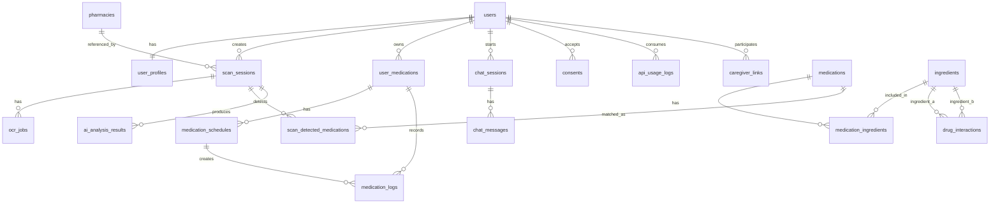

# 이약뭐지 백엔드/ERD 프로덕션 설계 계획

이 문서는 `introduce.md`의 서비스 기획을 바탕으로 Supabase, TypeScript 백엔드, Google OCR, Gemini를 사용해 프로덕션에 올리기 전 필요한 백엔드 구조를 정리한 문서다.

## 1. 설계 원칙

본 서비스는 처방전, 약봉투, 약 사진, 복약 이력처럼 민감한 건강 정보를 다룬다. 따라서 백엔드는 단순히 AI 응답을 저장하는 구조가 아니라, 공식 의약품 데이터베이스를 기준으로 정보를 검증하고 AI는 이해하기 쉬운 설명을 생성하는 보조 계층으로 사용해야 한다.

핵심 원칙은 다음과 같다.

- Google OCR은 텍스트 추출 도구로만 사용한다.
- OCR 결과를 곧바로 약품 확정값으로 사용하지 않는다.
- Gemini는 의료 판단의 최종 결정자가 아니라 설명 생성 및 질의응답 보조 도구로 사용한다.
- 약물 상호작용, 금기, 주의 경고는 가능한 한 별도 DB 또는 공식 출처 기반 룰로 판단한다.
- 처방전/약봉투 이미지는 분석 후 삭제하는 것을 기본 정책으로 한다.
- 모든 사용자별 건강 정보 테이블에는 Supabase Row Level Security를 적용한다.
- Google API 키, Supabase service role key, 공공데이터포털 키는 클라이언트에 절대 노출하지 않는다.

## 2. Supabase 사용 범위

Supabase는 다음 역할을 담당한다.

- Auth: 사용자 로그인, 보호자 계정, 환자 계정 관리
- Postgres: 사용자 프로필, 복용약, OCR 분석 결과, 챗봇 이력, 동의 이력 저장
- Storage: 처방전/약봉투 이미지 임시 저장
- Edge Functions: Google OCR, Gemini, 공공 의약품 API 호출을 서버 측에서 처리
- RLS: 사용자별 데이터 접근 제어

이미지와 AI API 처리는 클라이언트에서 직접 수행하지 않는다. 클라이언트는 Supabase Edge Function 또는 별도 TypeScript 서버에 요청하고, 서버가 Google API를 호출한다.

## 3. 권장 ERD



## 4. 테이블 설계

### 4.1 user_profiles

Supabase Auth의 `auth.users`를 서비스 도메인에 맞게 확장한다.

주요 컬럼:

- `user_id uuid primary key references auth.users(id)`
- `display_name text`
- `birth_year integer`
- `role text`: `patient`, `caregiver`, `admin`
- `phone text`
- `accessibility_preference jsonb`: 큰 글씨, 음성 안내, 간단 모드 등
- `created_at timestamptz`
- `updated_at timestamptz`

주의:

- 의료 서비스 특성상 생년월일 전체보다 출생연도만 저장하는 편이 안전하다.
- 주민등록번호, 상세 진단명 같은 고위험 개인정보는 MVP에서 저장하지 않는다.

### 4.2 medications

공공 의약품 DB에서 가져온 약품 마스터 테이블이다.

주요 컬럼:

- `id uuid primary key`
- `item_seq text unique`: 품목기준코드
- `item_name text`
- `entp_name text`: 업체명
- `edi_code text`
- `atc_code text`
- `bar_codes text[]`
- `efficacy text`
- `dosage text`
- `precautions text`
- `side_effects text`
- `storage_method text`
- `source text`: 예: `data.go.kr`, `mfds`, `drug_info`
- `raw_source jsonb`
- `source_updated_at timestamptz`
- `created_at timestamptz`
- `updated_at timestamptz`

주의:

- 사용자가 직접 수정하는 데이터가 아니라 서버 배치 또는 관리자 작업으로 갱신한다.
- `item_seq`를 우선 매칭 키로 사용한다.
- OCR 기반 매칭은 `item_name`, `edi_code`, `bar_codes`, 유사도 검색을 함께 사용한다.

### 4.3 ingredients

성분 마스터 테이블이다.

주요 컬럼:

- `id uuid primary key`
- `code text`
- `name text`
- `normalized_name text`
- `created_at timestamptz`

### 4.4 medication_ingredients

약품과 성분의 다대다 관계를 저장한다.

주요 컬럼:

- `medication_id uuid references medications(id)`
- `ingredient_id uuid references ingredients(id)`
- `amount text`
- `unit text`

복합제는 하나의 약품에 여러 성분이 연결될 수 있다.

### 4.5 scan_sessions

사용자의 사진 분석 1회를 나타낸다.

주요 컬럼:

- `id uuid primary key`
- `user_id uuid references auth.users(id)`
- `image_path text`
- `status text`: `uploaded`, `ocr_processing`, `matching`, `completed`, `failed`, `deleted`
- `ocr_text text`
- `confidence numeric`
- `pharmacy_id uuid references pharmacies(id)`
- `error_message text`
- `created_at timestamptz`
- `completed_at timestamptz`
- `image_deleted_at timestamptz`

주의:

- `image_path`는 임시 Storage 경로다.
- OCR 완료 후 이미지를 삭제하고 `image_deleted_at`을 기록한다.
- OCR 원문에도 개인정보가 포함될 수 있으므로 보관 기간을 짧게 두는 것이 좋다.

### 4.6 ocr_jobs

Google OCR 호출 상태와 원본 응답을 관리한다.

주요 컬럼:

- `id uuid primary key`
- `scan_id uuid references scan_sessions(id)`
- `provider text`: `google_vision`
- `status text`: `pending`, `processing`, `succeeded`, `failed`
- `request_id text`
- `input_image_path text`
- `result_json jsonb`
- `error_code text`
- `error_message text`
- `started_at timestamptz`
- `finished_at timestamptz`

필요 이유:

- OCR은 외부 API이므로 실패, 재시도, 비용 추적이 필요하다.
- `scan_sessions`와 분리해야 운영 중 장애 분석이 쉽다.

### 4.7 scan_detected_medications

사진 1장에서 감지된 약품 후보를 저장한다.

주요 컬럼:

- `id uuid primary key`
- `scan_id uuid references scan_sessions(id)`
- `medication_id uuid references medications(id)`
- `detected_name text`
- `matched_name text`
- `confidence numeric`
- `match_method text`: `exact`, `fuzzy`, `edi_code`, `barcode`, `manual_review`
- `dosage_instruction jsonb`
- `warning_message text`
- `needs_confirmation boolean`
- `created_at timestamptz`

주의:

- confidence가 낮으면 `needs_confirmation = true`로 둔다.
- 사용자가 확인하기 전까지 현재 복용약으로 자동 등록하지 않는다.

### 4.8 user_medications

사용자가 실제로 복용 중인 약 목록이다.

주요 컬럼:

- `id uuid primary key`
- `user_id uuid references auth.users(id)`
- `medication_id uuid references medications(id)`
- `source_scan_id uuid references scan_sessions(id)`
- `custom_name text`
- `start_date date`
- `end_date date`
- `source text`: `scan`, `caregiver`, `admin`, `manual_confirmed`
- `active boolean`
- `created_at timestamptz`
- `updated_at timestamptz`

주의:

- Won't 범위에 "수동 검색"은 제외되어 있으나, OCR 결과를 사용자가 확인해 등록하는 흐름은 필요하다.
- 완전 수동 약품 검색 기능과 OCR 결과 확인 기능은 구분해야 한다.

### 4.9 medication_schedules

복약 알림 스케줄이다.

주요 컬럼:

- `id uuid primary key`
- `user_medication_id uuid references user_medications(id)`
- `take_time time`
- `timing_rule text`: `before_meal`, `after_meal`, `with_meal`, `bedtime`, `custom`
- `dose_amount numeric`
- `dose_unit text`
- `days_of_week integer[]`
- `notification_enabled boolean`
- `created_at timestamptz`
- `updated_at timestamptz`

### 4.10 medication_logs

복용 완료, 누락, 건너뜀 상태를 기록한다.

주요 컬럼:

- `id uuid primary key`
- `user_medication_id uuid references user_medications(id)`
- `schedule_id uuid references medication_schedules(id)`
- `planned_date date`
- `planned_time time`
- `taken_at timestamptz`
- `status text`: `pending`, `taken`, `missed`, `skipped`
- `created_at timestamptz`
- `updated_at timestamptz`

### 4.11 drug_interactions

약물 상호작용 기준 테이블이다.

주요 컬럼:

- `id uuid primary key`
- `ingredient_a_id uuid references ingredients(id)`
- `ingredient_b_id uuid references ingredients(id)`
- `severity text`: `contraindicated`, `major`, `moderate`, `minor`, `unknown`
- `description text`
- `recommendation text`
- `source text`
- `source_url text`
- `updated_at timestamptz`

주의:

- Gemini에게 상호작용 판단을 전적으로 맡기지 않는다.
- 초기에는 공신력 있는 DB 확보가 어려우면 `unknown` 또는 `전문가 확인 필요` 중심으로 제한한다.

### 4.12 ai_analysis_results

Gemini가 생성한 분석 결과를 저장한다.

주요 컬럼:

- `id uuid primary key`
- `scan_id uuid references scan_sessions(id)`
- `model_name text`
- `prompt_version text`
- `input_snapshot jsonb`
- `output_json jsonb`
- `safety_blocked boolean`
- `confidence numeric`
- `created_at timestamptz`

주의:

- Gemini 출력은 `medications`의 공식 정보와 구분해서 저장한다.
- `input_snapshot`에는 Gemini에 전달한 약품 정보, OCR 텍스트 일부, 사용자 질문 맥락을 저장하되 민감정보 최소화를 적용한다.

### 4.13 chat_sessions

챗봇 대화방이다.

주요 컬럼:

- `id uuid primary key`
- `user_id uuid references auth.users(id)`
- `scan_id uuid references scan_sessions(id)`
- `created_at timestamptz`

### 4.14 chat_messages

챗봇 메시지 이력이다.

주요 컬럼:

- `id uuid primary key`
- `chat_session_id uuid references chat_sessions(id)`
- `role text`: `user`, `assistant`, `system`
- `content text`
- `model_name text`
- `citations jsonb`
- `safety_level text`: `info`, `caution`, `urgent`
- `needs_doctor_or_pharmacist boolean`
- `created_at timestamptz`

주의:

- 답변 근거가 된 `medication_id`, `drug_interaction_id`, `scan_detected_medication_id`를 `citations`에 저장한다.
- 의료 면책 문구와 전문가 상담 안내는 응답 생성 단계에서 강제한다.

### 4.15 pharmacies

처방전 기반 약국 안내 또는 OCR 실패 시 연락처 안내에 사용한다.

주요 컬럼:

- `id uuid primary key`
- `name text`
- `phone text`
- `address text`
- `lat numeric`
- `lng numeric`
- `source text`
- `created_at timestamptz`

### 4.16 caregiver_links

보호자와 환자 간 연결을 관리한다.

주요 컬럼:

- `id uuid primary key`
- `patient_user_id uuid references auth.users(id)`
- `caregiver_user_id uuid references auth.users(id)`
- `status text`: `invited`, `accepted`, `revoked`
- `permission_scope jsonb`: 복약 현황 조회, 알림 수신 등
- `consented_at timestamptz`
- `revoked_at timestamptz`
- `created_at timestamptz`

주의:

- 보호자는 환자가 동의한 범위만 조회할 수 있어야 한다.
- 보호자가 환자의 OCR 원문이나 처방전 이미지를 직접 볼 수 있게 할지는 별도 동의가 필요하다.

### 4.17 consents

개인정보, 민감정보, AI 처리, 보호자 공유 동의 기록이다.

주요 컬럼:

- `id uuid primary key`
- `user_id uuid references auth.users(id)`
- `type text`: `privacy`, `sensitive_health_data`, `ai_processing`, `caregiver_share`, `marketing`
- `version text`
- `accepted_at timestamptz`
- `revoked_at timestamptz`
- `metadata jsonb`

### 4.18 audit_logs

민감 데이터 접근 이력을 남긴다.

주요 컬럼:

- `id uuid primary key`
- `actor_user_id uuid references auth.users(id)`
- `action text`
- `target_type text`
- `target_id uuid`
- `ip text`
- `user_agent text`
- `created_at timestamptz`

### 4.19 api_usage_logs

Google OCR, Gemini, 공공데이터 API 사용량과 비용 추적용이다.

주요 컬럼:

- `id uuid primary key`
- `user_id uuid references auth.users(id)`
- `provider text`: `google_vision`, `gemini`, `data_go_kr`
- `endpoint text`
- `request_count integer`
- `token_count integer`
- `image_count integer`
- `cost_estimate numeric`
- `status text`
- `created_at timestamptz`

## 5. TypeScript 백엔드 기능

### 5.1 Google OCR 함수

Endpoint:

```text
POST /functions/v1/google-ocr
```

역할:

- 인증된 사용자만 호출 가능
- Supabase Storage의 임시 이미지 경로 확인
- Google Cloud Vision OCR 호출
- OCR 원문 저장
- OCR 작업 상태 저장
- 실패 시 재시도 가능 상태로 기록
- 분석 완료 후 이미지 삭제 작업 예약 또는 즉시 삭제

주의:

- Google Vision API 키 또는 서비스 계정 정보는 서버 Secret에만 저장한다.
- 클라이언트가 Google OCR API를 직접 호출하면 안 된다.

### 5.2 약품 분석 함수

Endpoint:

```text
POST /functions/v1/analyze-medication
```

역할:

- OCR 텍스트 정규화
- 약품명 후보 추출
- `medications`와 매칭
- fuzzy match, exact match, barcode, EDI 코드 매칭 지원
- confidence 산정
- confidence가 낮으면 확정하지 않고 사용자 확인 요청
- 감지 결과를 `scan_detected_medications`에 저장

### 5.3 Gemini 챗봇 함수

Endpoint:

```text
POST /functions/v1/gemini-chat
```

역할:

- 사용자 질문 수신
- 현재 복용약, 최근 scan 결과, 공식 약품 정보 조회
- 상호작용 DB 조회
- Gemini에 제한된 컨텍스트 전달
- 구조화된 JSON 응답 생성
- 응답 검증 후 `chat_messages`에 저장

Gemini 응답 스키마 예시:

```ts
type MedicationAnswer = {
  answer: string;
  safetyLevel: "info" | "caution" | "urgent";
  needsDoctorOrPharmacist: boolean;
  citedMedicationIds: string[];
  citedInteractionIds: string[];
  disclaimer: string;
};
```

주의:

- Gemini가 공식 DB에 없는 내용을 단정하지 못하도록 프롬프트와 후처리를 구성한다.
- `needsDoctorOrPharmacist`가 `true`인 경우 UI에서 상담 안내를 강하게 표시한다.

### 5.4 상호작용 검사 함수

Endpoint:

```text
POST /functions/v1/check-interactions
```

역할:

- 사용자 현재 복용약 조회
- 새로 감지된 약의 성분 조회
- `drug_interactions` 기준으로 위험도 계산
- 위험도가 불명확하면 `unknown`으로 반환하고 전문가 확인 안내

주의:

- 상호작용 판단은 Gemini 단독으로 처리하지 않는다.

### 5.5 공공 의약품 마스터 동기화 함수

Endpoint:

```text
POST /functions/v1/sync-drug-master
```

역할:

- 공공데이터포털 의약품 API 호출
- `item_seq` 기준 upsert
- 성분 정보 파싱
- `medications`, `ingredients`, `medication_ingredients` 갱신
- 원본 응답을 `raw_source`에 저장

주의:

- 운영자 또는 scheduled job만 실행 가능해야 한다.
- 사용자가 직접 실행할 수 있으면 API 비용과 데이터 오염 위험이 있다.

### 5.6 복약 스케줄/로그 함수

Endpoints:

```text
POST /functions/v1/medication-schedules
POST /functions/v1/medication-logs/check
```

역할:

- 복용 시간 등록
- 복용 완료 체크
- 미복용 상태 기록
- 푸시 알림 시스템과 연동할 데이터 생성

주의:

- 실제 푸시 발송은 FCM/APNs가 필요하다.
- Supabase는 알림 대상과 상태를 저장하고, 발송은 별도 worker 또는 scheduled function에서 처리한다.

### 5.7 보호자 동의/연동 함수

Endpoints:

```text
POST /functions/v1/caregiver/invite
POST /functions/v1/caregiver/consent
POST /functions/v1/caregiver/revoke
```

역할:

- 보호자 초대
- 환자 동의
- 권한 범위 저장
- 보호자 접근 해지

주의:

- MVP에서 보호자 기능은 Could 범위이므로 일정이 빠듯하면 후순위로 둔다.
- 구현 시 동의 기록과 접근 로그가 반드시 필요하다.

## 6. RLS 정책 원칙

모든 사용자 건강 정보 테이블에는 RLS를 켠다.

사용자 본인만 접근 가능한 테이블:

- `user_profiles`
- `scan_sessions`
- `ocr_jobs`
- `scan_detected_medications`
- `user_medications`
- `medication_schedules`
- `medication_logs`
- `chat_sessions`
- `chat_messages`
- `consents`
- `api_usage_logs`

공개 읽기 가능성이 있는 테이블:

- `medications`
- `ingredients`
- `medication_ingredients`

단, 공개 읽기는 서비스 정책에 따라 결정한다. 약품 마스터가 공개되어도 되는 정보인지 확인해야 한다.

서버 전용 테이블:

- `audit_logs`
- `ai_analysis_results`
- `drug_interactions`의 쓰기 작업

보호자 접근:

- `caregiver_links.status = 'accepted'`
- `permission_scope`에 해당 권한이 있음
- 환자가 동의를 철회하지 않음

이 조건을 만족할 때만 제한된 읽기 접근을 허용한다.

## 7. Storage 정책

권장 버킷:

```text
prescription-temp
```

정책:

- private bucket
- 사용자는 자기 경로에만 업로드 가능
- 경로 예시: `user_id/scan_id/original.jpg`
- signed upload URL 사용
- OCR 완료 후 즉시 삭제
- 실패한 이미지도 TTL 기반으로 삭제
- 이미지 원본을 장기 보관하지 않음

DB에는 다음만 저장한다.

- 분석 상태
- OCR 원문
- 매칭 결과
- 이미지 삭제 시각

OCR 원문도 민감정보가 포함될 수 있으므로 보관 기간 정책을 별도로 정해야 한다.

## 8. Google OCR 연동 원칙

Google OCR은 Cloud Vision API의 text detection 또는 document text detection을 사용한다.

처리 흐름:

```text
이미지 업로드
-> scan_sessions 생성
-> google-ocr 함수 호출
-> Google Vision OCR 호출
-> OCR 원문 저장
-> 약품명 후보 추출
-> 공식 DB 매칭
-> 낮은 confidence는 사용자 확인
-> 이미지 삭제
```

주의:

- OCR 정확도가 높아도 약품명 오인식은 치명적일 수 있다.
- confidence threshold를 반드시 둔다.
- 자동 등록 대신 사용자 확인 단계를 둔다.
- OCR 실패 시 처방 약국 연락처 안내 또는 재촬영 안내를 제공한다.

## 9. Gemini 연동 원칙

Gemini는 다음 용도로 사용한다.

- OCR 결과를 사람이 이해하기 쉬운 문장으로 정리
- 사용자의 자연어 질문에 쉬운 말로 답변
- 복약법, 주의사항을 공식 DB 기반으로 요약

Gemini에 맡기면 안 되는 것:

- 약물 상호작용 최종 판단
- 금기 여부 단정
- 처방 변경 권고
- 복용 중단 권고
- 응급상황 진단

Gemini 프롬프트에는 다음 제한을 포함한다.

- 제공된 공식 약품 정보와 사용자 복용약 정보 안에서만 답변한다.
- 불확실하면 모른다고 말하고 약사/의사 상담을 안내한다.
- 처방 변경, 복용 중단, 용량 변경을 지시하지 않는다.
- 고령층도 이해할 수 있는 쉬운 한국어로 답변한다.
- 반드시 JSON Schema에 맞춰 응답한다.

## 10. 보안상 주요 위험과 대응

### 10.1 API 키 유출

위험:

- Gemini, Google OCR, 공공데이터 API 키가 유출되면 비용 폭탄과 데이터 유출 위험이 있다.

대응:

- API 키는 Supabase Secret 또는 서버 환경변수에만 저장
- 클라이언트 코드에 키 포함 금지
- Google Cloud API 키 제한 설정
- 서비스 계정 권한 최소화
- 예산 알림과 쿼터 설정
- 키 정기 회전

### 10.2 의료정보 오안내

위험:

- AI가 잘못된 복약 안내를 하면 사용자 안전 문제가 발생할 수 있다.

대응:

- 공식 의약품 DB 기반 답변
- Gemini 답변에는 출처 ID 연결
- 상호작용은 DB 룰 기반 검사
- confidence 낮을 때 자동 확정 금지
- 면책 문구 상시 표시
- 고위험 답변은 전문가 상담 안내

### 10.3 개인정보/민감정보 과다 보관

위험:

- 처방전 이미지, OCR 원문, 복약 이력은 민감한 건강 정보다.

대응:

- 이미지 분석 후 삭제
- OCR 원문 보관 기간 제한
- 사용자 동의 기록 저장
- RLS 적용
- 보호자 접근 범위 제한
- audit log 저장

### 10.4 RLS 우회

위험:

- service role key가 잘못 사용되면 RLS를 우회할 수 있다.

대응:

- service role key는 서버에서만 사용
- 클라이언트에는 anon key만 사용
- Edge Function에서 사용자 JWT 검증
- 관리자 함수는 별도 권한 검사

## 11. MVP 우선순위

### 1차 MVP 필수

- Supabase Auth
- `user_profiles`
- `medications`
- `ingredients`
- `medication_ingredients`
- `scan_sessions`
- `ocr_jobs`
- `scan_detected_medications`
- `user_medications`
- `chat_sessions`
- `chat_messages`
- Google OCR Edge Function
- Gemini Chat Edge Function
- 공공 의약품 DB 동기화
- RLS
- 이미지 임시 저장/삭제

### 1.5차 권장

- `medication_schedules`
- `medication_logs`
- `api_usage_logs`
- rate limit
- Google Cloud 예산 알림
- OCR confidence UI

### 2차 확장

- 보호자 연동
- 복약 리포트
- 약국/병원 찾기
- 잔여량 예측
- 로컬 광고

## 12. 프로덕션 전 확인 항목

- 모든 민감 테이블에 RLS가 켜져 있는가
- Storage 버킷이 private인가
- 사용자가 자기 이미지 경로에만 접근 가능한가
- OCR 완료 후 이미지가 삭제되는가
- Google/Gemini 키가 클라이언트에 노출되지 않는가
- Gemini 응답을 JSON Schema로 검증하는가
- Gemini가 공식 DB 밖 내용을 단정하지 못하게 막는가
- 약물 상호작용 판단을 LLM 단독으로 하지 않는가
- API 사용량과 비용 로그가 남는가
- 사용자별 호출 제한이 있는가
- 보호자 접근은 동의 기반인가
- 개인정보/민감정보 처리 동의 버전이 기록되는가
- 면책 문구가 주요 화면에 표시되는가
- 키 유출 시 폐기/교체 절차가 준비되어 있는가

